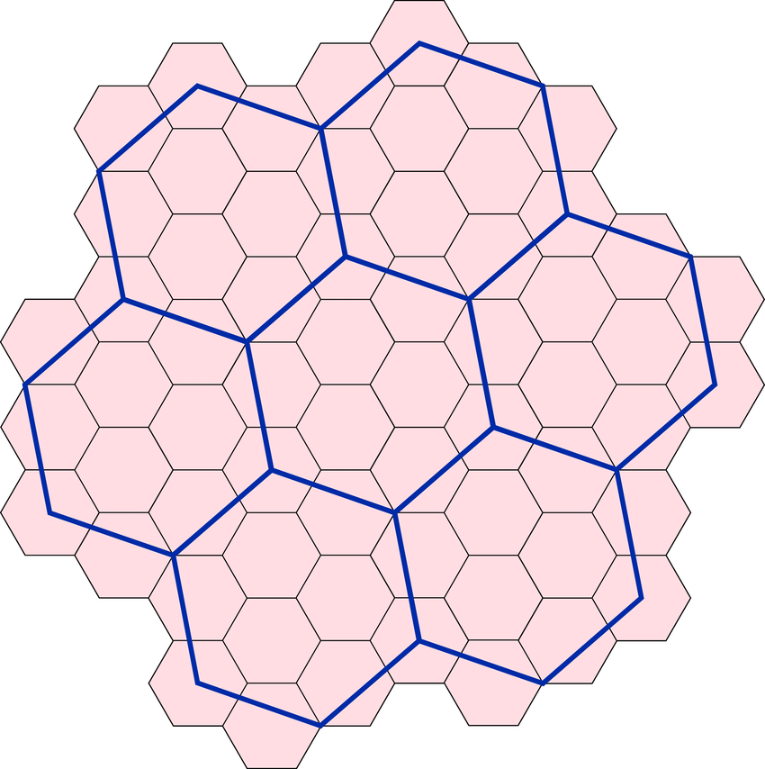

# Territory System

The game world is divided into three map layers: **Hex Layer**, **Clan Territory Layer**, and **Global Layer**.

## Hex Layer

- Area: 0.015 km² (15,000 m²)
- Count: 34 billion hexes worldwide
- Basic unit for capturing territory

## Clan Territory Layer

- Area: 0.737 km² (737,000 m²)
- Structure: 7 regular hexes (1 central + 6 surrounding)
- Shows clan dominance in regions

### Control Rules
- Need 4+ hexes (>50%) for clan control
- Example: 4/7 hexes = 57% = clan control
- Updates dynamically with captures

### Area Formula
A_clan = 7 × A_regular = 7 × 0.015 km² = 0.737 km²

## Global Layer
- World map overview
- Total clan territories
- Global influence visualization